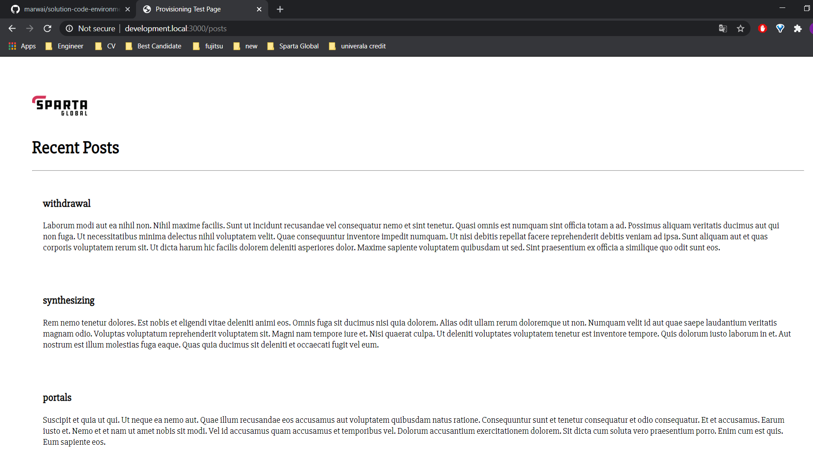

# Nginx Reverse Proxy  

## What is Nginx  

- Nginx is an open source high performance web server (stores, processes and delivers web pages to users) that powers many modern web applications.

## What is a forward proxy?  
- A forward proxy, often called a proxy, proxy server, web proxy, is a server that sits in front of a group of client machines
- When those computers make requests to sites and services on the Internet, the proxy server intercepts those requests and then communicates with web servers on behalf of those clients, like an intermediary.

## What is a reverse proxy?  
Reverse proxies control access to a server on private networks. A reverse proxy can perform authentication tasks, as well as cache or decrypt data.


## Multi-Machine Vagrant 

```
Vagrant up 
vagrant ssh app
nano /etc/nginx/sites-default 
cd sites-available 
nano default 
sudo rm -r default 
ls - nothhing in sites avaiable
touch default - make again
sudo touch default 

sudo nano default

server {
    listen 80;
    server_name _;
    location / {
        proxy_pass http://localhost:3000;
        proxy_http_version 1.1;
        proxy_set_header Upgrade $http_upgrade;
        proxy_set_header Connection 'upgrade';
        proxy_set_header Host $host;
        proxy_cache_bypass $http_upgrade;
    }
}


cntrl s 


sugo nginx -t 

sudo systemctl restart nginx nginx 

sudo systemctrl status nginx

sudo node app.js
```

check browser

# Error 

After running Vagrant up, only the app vm is ran, db vm has to be manually initialisied with vagrant up db. 
This error below occured:
```
 app: Fetched 22.0 MB in 2s (7,710 kB/s)

    app: E
    app: :
    app: Failed to fetch https://deb.nodesource.com/node_12.x/pool/main/n/nodejs/nodejs_12.18.3-1nodeso
urce1_amd64.deb  Hash Sum mismatch
    app: E
    app: :
    app: Unable to fetch some archives, maybe run apt-get update or try with --fix-missing?
    app: sudo
    app: : npm: command not found
The SSH command responded with a non-zero exit status. Vagrant
assumes that this means the command failed. The output for this command
should be in the log above. Please read the output to determine what
went wrong.

```
This was fixed through:
```
sudo su
npm install pm2 -g # in the code app root 

```
## After Vagrant up db, another error is thrown. Despite using the same code given in class, it was unable to connect to mongodb 
## __MONGODB__ error
```
 db: E: Failed to fetch https://repo.mongodb.org/apt/ubuntu/dists/xenial/mongodb-org/3.2/multiverse/
binary-amd64/mongodb-org-server_3.2.20_amd64.deb  Hash Sum mismatch
    db:
    db: E: Unable to fetch some archives, maybe run apt-get update or try with --fix-missing?
    db: rm:
    db: cannot remove '/etc/mongod.conf'
    db: : No such file or directory
    db: Failed to restart mongod.service: Unit mongod.service not found.
    db: Failed to execute operation: No such file or directory
The SSH command responded with a non-zero exit status. Vagrant
assumes that this means the command failed. The output for this command
should be in the log above. Please read the output to determine what
went wrong.
```



